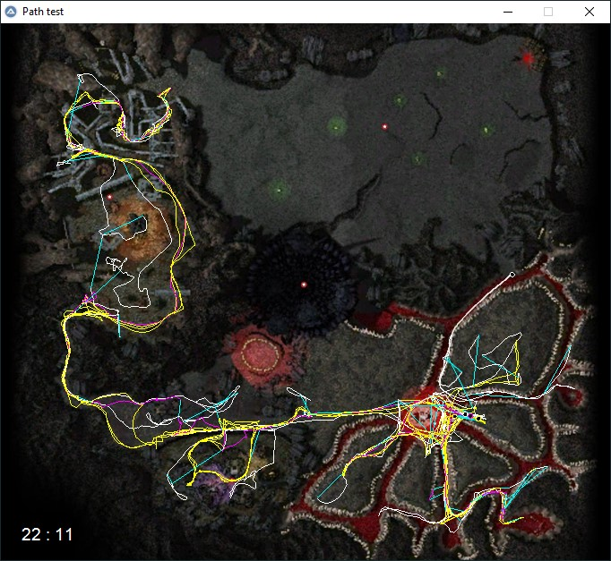

# GW path visualizer

Creates an animated visualization of one or more "path log", a file that records the player position over time. 

## How to use
* Install [AutoIt3](https://www.autoitscript.com/site/)
* Edit `path_visualizer.au3` to specify the number of players, specify the paths to your logs, and customize colors
* Run `path_visualizer.au3`. 

## How to get path logs
In [GWToolbox](www.gwtoolbox.com), enable "Save Location Data" in Settings > Toolbox Settings, then find them in `%user%/AppData/Local/GWToolboxpp/location logs`. 

## Example

https://www.youtube.com/watch?v=QQ0DAOc2fT0

